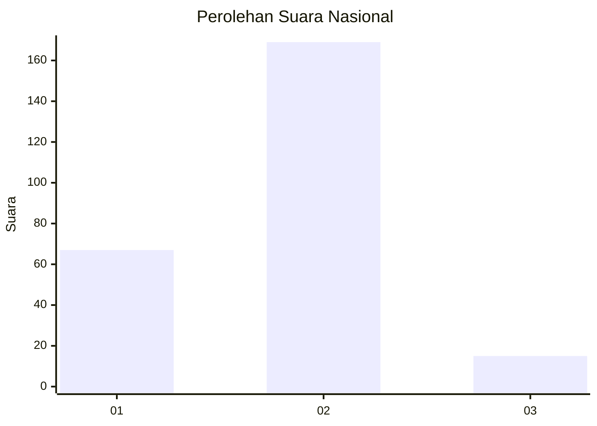
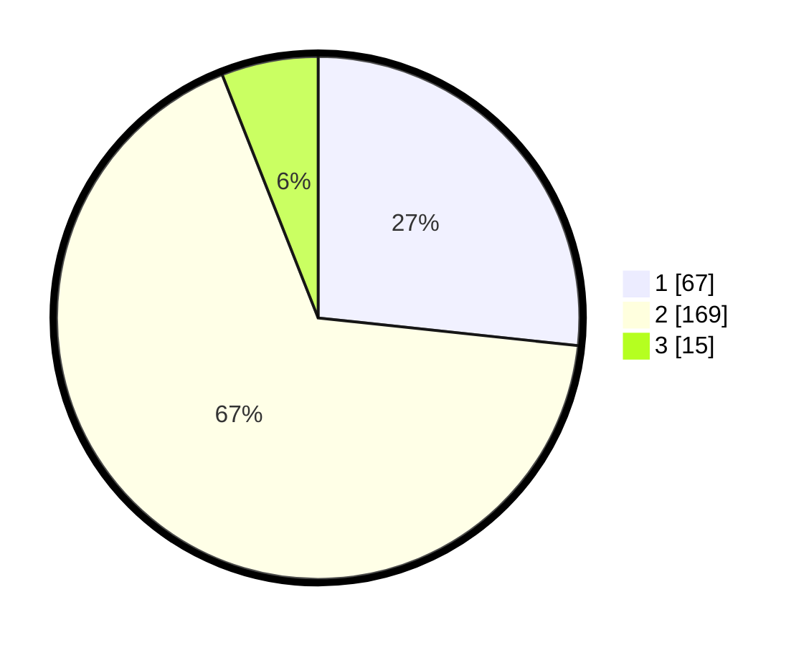

# Hasil

## Grafik

## Tabel

| No. | Nama Paslon    | Suara | Suara (raw) | Persentase |
|:--- |:-------------- | -----:| -----------:| ----------:|
| 1   | ANIES MUHAIMIN | 67    | [67][p-1]   | 26,69      |
| 2   | PRABOWO GIBRAN | 169   | [169][p-2]  | 67,33      |
| 3   | GANJAR MAHFUD  | 15    | [15][p-3]   | 5,98       |

[p-1]: https://github.com/gigit-pemilu/pemilu-2024/blob/main/pilpres/hitung-suara/sub/18-lampung/sub/71-kota-bandar-lampung/sub/13-kemiling/sub/1001-sumber-rejo/sub/004-tps/sub/paslon-1.txt
[p-2]: https://github.com/gigit-pemilu/pemilu-2024/blob/main/pilpres/hitung-suara/sub/18-lampung/sub/71-kota-bandar-lampung/sub/13-kemiling/sub/1001-sumber-rejo/sub/004-tps/sub/paslon-2.txt
[p-3]: https://github.com/gigit-pemilu/pemilu-2024/blob/main/pilpres/hitung-suara/sub/18-lampung/sub/71-kota-bandar-lampung/sub/13-kemiling/sub/1001-sumber-rejo/sub/004-tps/sub/paslon-3.txt

## Foto C Plano

https://sirekap-obj-formc.kpu.go.id/9942/pemilu/ppwp/18/71/13/10/01/1871131001004-20240215-080148--3a3a0384-35c8-457c-91ba-07ca7ecfa4d1.jpg

https://sirekap-obj-formc.kpu.go.id/9942/pemilu/ppwp/18/71/13/10/01/1871131001004-20240215-080203--40799e7c-a206-4ceb-8dbc-bf76b74d1e6b.jpg

https://sirekap-obj-formc.kpu.go.id/9942/pemilu/ppwp/18/71/13/10/01/1871131001004-20240215-080221--1ce89894-3bb4-4dd6-b271-bb9d0dea36d5.jpg

## Metadata

| Key        | Value               |
| ---------- | ------------------- |
| Time Stamp | 2024-02-17 16:00:02 |

