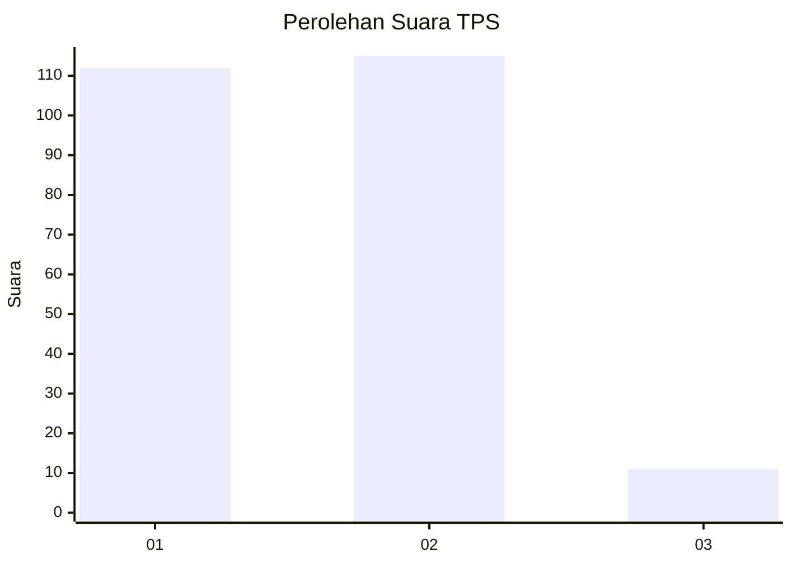
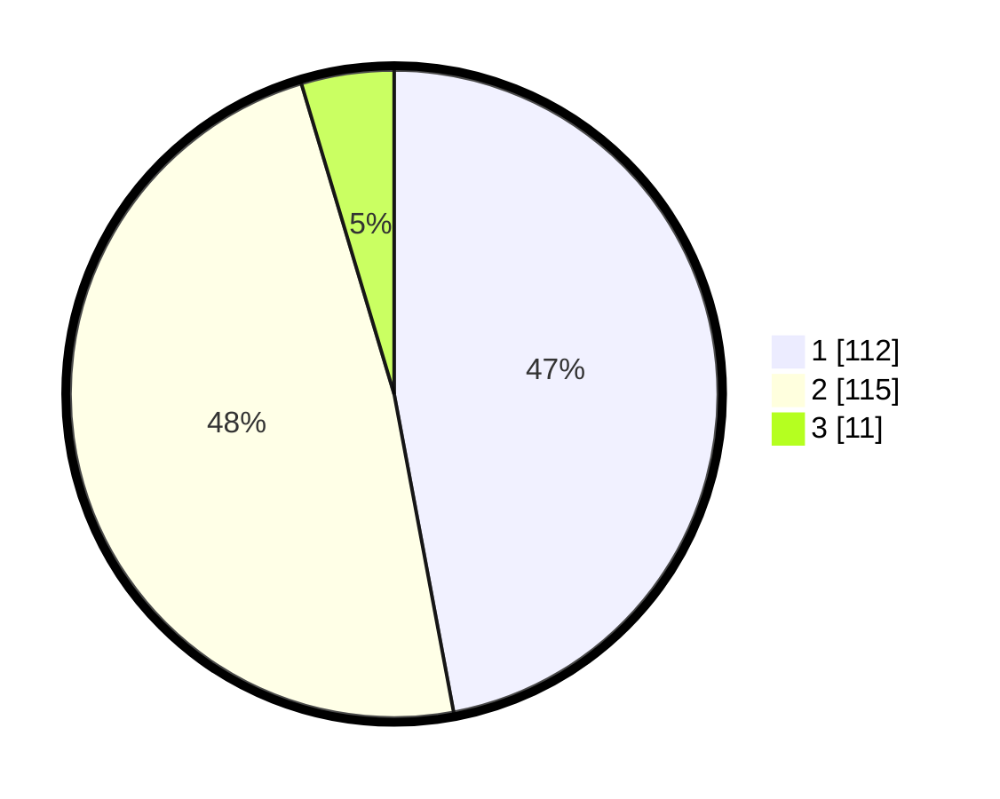

# Hasil

## Grafik

## Tabel

| No. | Nama Paslon    | Suara | Suara (raw) | Persentase |
|:--- |:-------------- | -----:| -----------:| ----------:|
| 1   | ANIES MUHAIMIN | 112   | [112][p-1]  | 47,06      |
| 2   | PRABOWO GIBRAN | 115   | [115][p-2]  | 48,32      |
| 3   | GANJAR MAHFUD  | 11    | [11][p-3]   | 4,62       |

[p-1]: https://github.com/gigit-pemilu/pemilu-2024-18-lampung/blob/main/pilpres/hitung-suara/sub/18-lampung/sub/71-kota-bandar-lampung/sub/14-labuhan-ratu/sub/1001-labuhan-ratu/sub/004-tps/sub/paslon-1.txt
[p-2]: https://github.com/gigit-pemilu/pemilu-2024-18-lampung/blob/main/pilpres/hitung-suara/sub/18-lampung/sub/71-kota-bandar-lampung/sub/14-labuhan-ratu/sub/1001-labuhan-ratu/sub/004-tps/sub/paslon-2.txt
[p-3]: https://github.com/gigit-pemilu/pemilu-2024-18-lampung/blob/main/pilpres/hitung-suara/sub/18-lampung/sub/71-kota-bandar-lampung/sub/14-labuhan-ratu/sub/1001-labuhan-ratu/sub/004-tps/sub/paslon-3.txt

## Foto C Plano

https://sirekap-obj-formc.kpu.go.id/603b/pemilu/ppwp/18/71/14/10/01/1871141001004-20240215-003543--b25ed682-627c-4e3e-89a7-55e9ee9610f2.jpg

https://sirekap-obj-formc.kpu.go.id/603b/pemilu/ppwp/18/71/14/10/01/1871141001004-20240215-003537--aaa23025-5ca3-4ce5-a662-79705d4fdf41.jpg

https://sirekap-obj-formc.kpu.go.id/603b/pemilu/ppwp/18/71/14/10/01/1871141001004-20240215-003733--88b52f78-7fd0-4b5a-b4a4-29ed4d98edb9.jpg

## Metadata

| Key        | Value               |
| ---------- | ------------------- |
| Time Stamp | 2024-02-17 14:45:18 |

