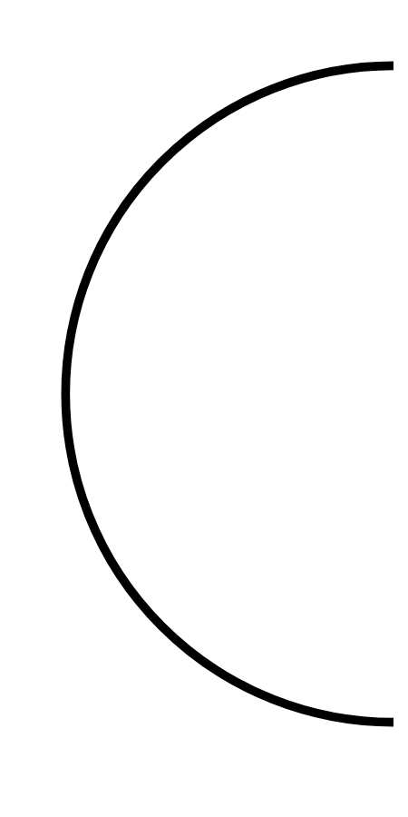

# Hasil

## Grafik

```mermaid
xychart-beta
    title "Perolehan Suara Nasional"
    x-axis []
    y-axis "Suara" 0 --> 0
    bar []
```



## Tabel

| No. | Nama Paslon | Suara | Suara (raw) | Persentase |
|:--- |:----------- | -----:| -----------:| ----------:|


[p-1]: https://github.com/gigit-pemilu/pemilu-2024/blob/main/pilpres/hitung-suara/sub/18-lampung/sub/71-kota-bandar-lampung/sub/15-way-halim/sub/1001-perumnas-way-halim/sub/004-tps/sub/paslon-1.txt
[p-2]: https://github.com/gigit-pemilu/pemilu-2024/blob/main/pilpres/hitung-suara/sub/18-lampung/sub/71-kota-bandar-lampung/sub/15-way-halim/sub/1001-perumnas-way-halim/sub/004-tps/sub/paslon-2.txt
[p-3]: https://github.com/gigit-pemilu/pemilu-2024/blob/main/pilpres/hitung-suara/sub/18-lampung/sub/71-kota-bandar-lampung/sub/15-way-halim/sub/1001-perumnas-way-halim/sub/004-tps/sub/paslon-3.txt

## Foto C Plano

https://sirekap-obj-formc.kpu.go.id/24cf/pemilu/ppwp/18/71/15/10/01/1871151001004-20240223-230137--f1d8a79e-df4c-4ab4-a9d0-d3b62322f2f0.jpg

https://sirekap-obj-formc.kpu.go.id/24cf/pemilu/ppwp/18/71/15/10/01/1871151001004-20240223-230615--ea1c7a21-c453-43c9-a3c9-85af12b5c35c.jpg

https://sirekap-obj-formc.kpu.go.id/24cf/pemilu/ppwp/18/71/15/10/01/1871151001004-20240223-230911--4c3fa8d2-ce13-4437-b90b-12453dbfa4c3.jpg


## Metadata

| Key        | Value               |
| ---------- | ------------------- |
| Time Stamp | 2024-02-24 22:31:28 |


## DATA PEMILIH TETAP

Jumlah pemilih dalam DPT: **300**.
 * L: **143**.
 * P: **157**.

## DATA PENGGUNA HAK PILIH

Jumlah pengguna hak pilih dalam DPT: **214**.
 * L: **44**.
 * P: **120**.

Jumlah pengguna hak pilih dalam DPTb: **89**.
 * L: **1**.
 * P: **83**.

Jumlah pengguna hak pilih dalam DPK: **3**.
 * L: **8**.
 * P: **83**.

Jumlah pengguna hak pilih: **226**.
 * L: **100**.
 * P: **126**.

## JUMLAH SUARA SAH DAN TIDAK SAH

JUMLAH SELURUH SUARA SAH: **224**.

JUMLAH SUARA TIDAK SAH: **2**.

JUMLAH SELURUH SUARA SAH DAN SUARA TIDAK SAH: **226**.


