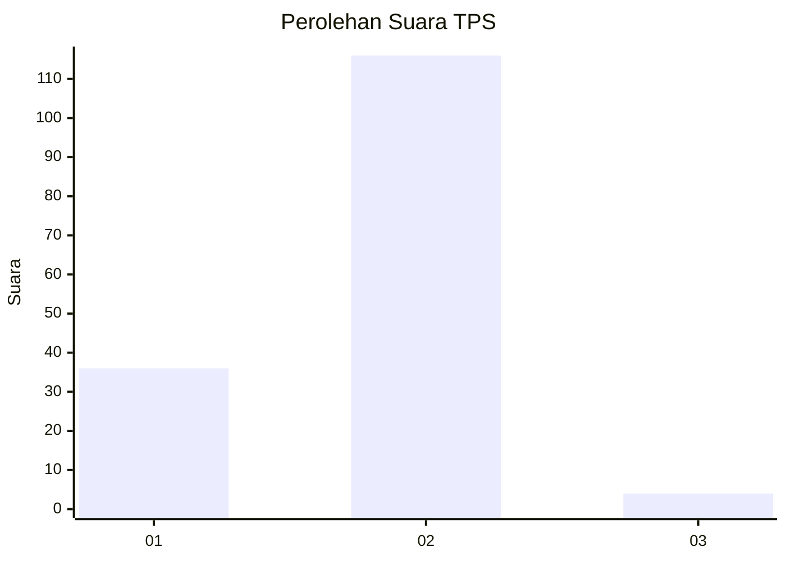
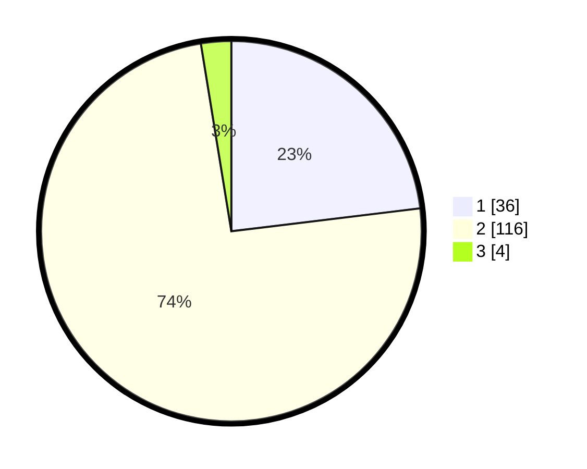

# Hasil

## Grafik

## Tabel

| No. | Nama Paslon    | Suara | Suara (raw) | Persentase |
|:--- |:-------------- | -----:| -----------:| ----------:|
| 1   | ANIES MUHAIMIN | 36    | [36][p-1]   | 23,08      |
| 2   | PRABOWO GIBRAN | 116   | [116][p-2]  | 74,36      |
| 3   | GANJAR MAHFUD  | 4     | [4][p-3]    | 2,56       |

[p-1]: https://github.com/gigit-pemilu/pemilu-2024-18-lampung/blob/main/pilpres/hitung-suara/sub/18-lampung/sub/71-kota-bandar-lampung/sub/16-langkapura/sub/1001-langkapura/sub/002-tps/sub/paslon-1.txt
[p-2]: https://github.com/gigit-pemilu/pemilu-2024-18-lampung/blob/main/pilpres/hitung-suara/sub/18-lampung/sub/71-kota-bandar-lampung/sub/16-langkapura/sub/1001-langkapura/sub/002-tps/sub/paslon-2.txt
[p-3]: https://github.com/gigit-pemilu/pemilu-2024-18-lampung/blob/main/pilpres/hitung-suara/sub/18-lampung/sub/71-kota-bandar-lampung/sub/16-langkapura/sub/1001-langkapura/sub/002-tps/sub/paslon-3.txt

## Foto C Plano

https://sirekap-obj-formc.kpu.go.id/afeb/pemilu/ppwp/18/71/16/10/01/1871161001002-20240214-202054--786c4eb7-09f5-45cf-9cc0-34c57bf0601f.jpg

https://sirekap-obj-formc.kpu.go.id/afeb/pemilu/ppwp/18/71/16/10/01/1871161001002-20240215-004829--86b51d13-958a-40b0-92b6-9044710da534.jpg

https://sirekap-obj-formc.kpu.go.id/afeb/pemilu/ppwp/18/71/16/10/01/1871161001002-20240215-005816--c1244249-7777-45bc-9b59-46a7669694e0.jpg

## Metadata

| Key        | Value               |
| ---------- | ------------------- |
| Time Stamp | 2024-02-15 18:00:26 |

