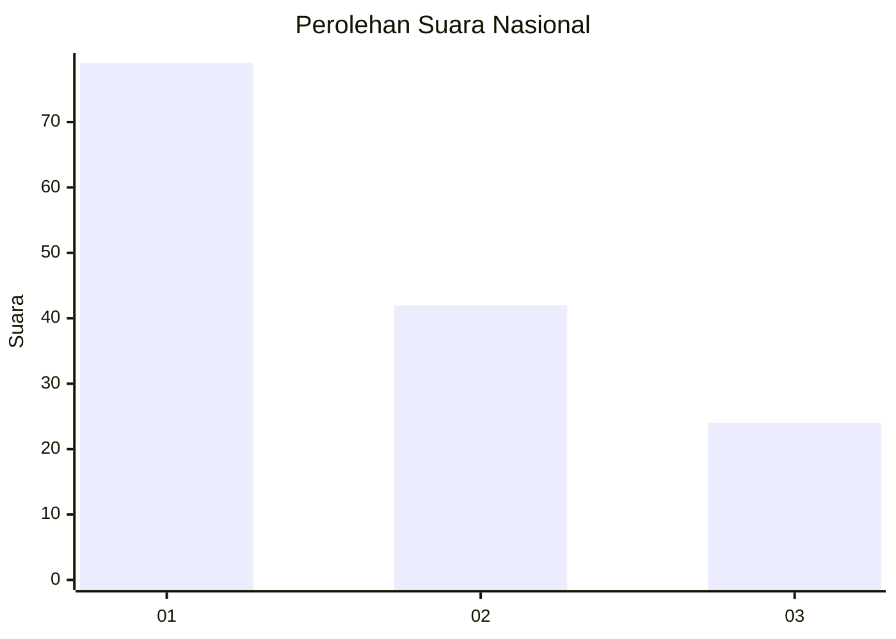
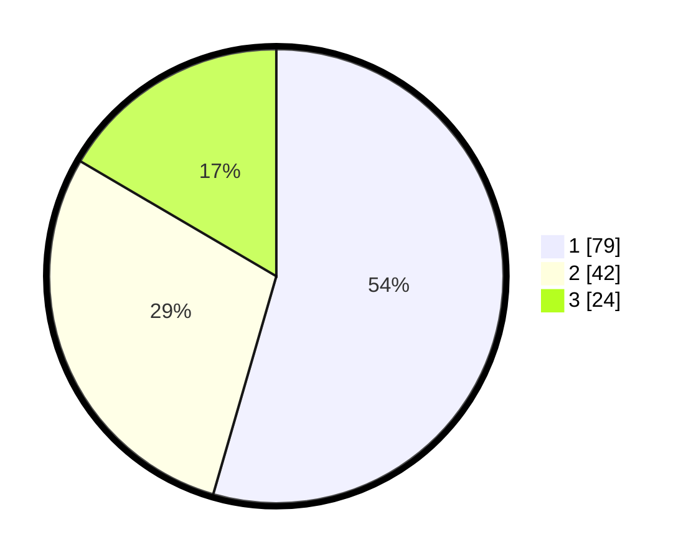

# Hasil

## Grafik

## Tabel

| No. | Nama Paslon    | Suara | Suara (raw) | Persentase |
|:--- |:-------------- | -----:| -----------:| ----------:|
| 1   | ANIES MUHAIMIN | 79    | [79][p-1]   | 54,48      |
| 2   | PRABOWO GIBRAN | 42    | [42][p-2]   | 28,97      |
| 3   | GANJAR MAHFUD  | 24    | [24][p-3]   | 16,55      |

[p-1]: https://github.com/gigit-pemilu/pemilu-2024/blob/main/pilpres/hitung-suara/sub/18-lampung/sub/71-kota-bandar-lampung/sub/17-enggal/sub/1001-enggal/sub/002-tps/sub/paslon-1.txt
[p-2]: https://github.com/gigit-pemilu/pemilu-2024/blob/main/pilpres/hitung-suara/sub/18-lampung/sub/71-kota-bandar-lampung/sub/17-enggal/sub/1001-enggal/sub/002-tps/sub/paslon-2.txt
[p-3]: https://github.com/gigit-pemilu/pemilu-2024/blob/main/pilpres/hitung-suara/sub/18-lampung/sub/71-kota-bandar-lampung/sub/17-enggal/sub/1001-enggal/sub/002-tps/sub/paslon-3.txt

## Foto C Plano

https://sirekap-obj-formc.kpu.go.id/e24c/pemilu/ppwp/18/71/17/10/01/1871171001002-20240218-122538--210c0802-4384-4413-beb1-f1c82102272e.jpg

https://sirekap-obj-formc.kpu.go.id/e24c/pemilu/ppwp/18/71/17/10/01/1871171001002-20240218-122623--298a98c3-b837-42bf-b9f7-f42059695891.jpg

https://sirekap-obj-formc.kpu.go.id/e24c/pemilu/ppwp/18/71/17/10/01/1871171001002-20240218-122734--36303a52-e330-4569-a601-66aba80ce500.jpg

## Metadata

| Key        | Value               |
| ---------- | ------------------- |
| Time Stamp | 2024-02-19 06:16:00 |

## DATA PEMILIH TETAP

Jumlah pemilih dalam DPT: **281**.
 * L: **577**.
 * P: **148**.

## DATA PENGGUNA HAK PILIH

Jumlah pengguna hak pilih dalam DPT: **197**.
 * L: **96**.
 * P: **102**.

Jumlah pengguna hak pilih dalam DPTb: **8**.
 * L: **8**.
 * P: **58**.

Jumlah pengguna hak pilih dalam DPK: **4**.
 * L: **7**.
 * P: **5**.

Jumlah pengguna hak pilih: **197**.
 * L: **54**.
 * P: **107**.

## JUMLAH SUARA SAH DAN TIDAK SAH

JUMLAH SELURUH SUARA SAH: **155**.

JUMLAH SUARA TIDAK SAH: **2**.

JUMLAH SELURUH SUARA SAH DAN SUARA TIDAK SAH: **197**.

