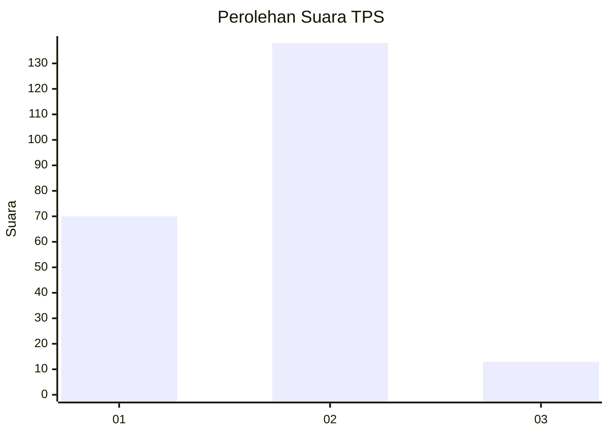
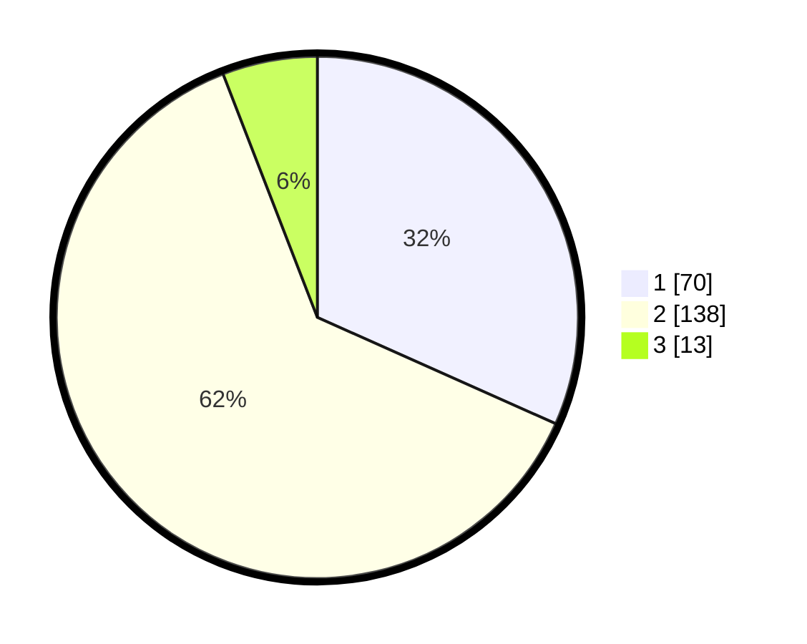

# Hasil

## Grafik

## Tabel

| No. | Nama Paslon    | Suara | Suara (raw) | Persentase |
|:--- |:-------------- | -----:| -----------:| ----------:|
| 1   | ANIES MUHAIMIN | 70    | [70][p-1]   | 31,67      |
| 2   | PRABOWO GIBRAN | 138   | [138][p-2]  | 62,44      |
| 3   | GANJAR MAHFUD  | 13    | [13][p-3]   | 5,88       |

[p-1]: https://github.com/gigit-pemilu/pemilu-2024-18-lampung/blob/main/pilpres/hitung-suara/sub/18-lampung/sub/71-kota-bandar-lampung/sub/18-kedamaian/sub/1001-kedamaian/sub/003-tps/sub/paslon-1.txt
[p-2]: https://github.com/gigit-pemilu/pemilu-2024-18-lampung/blob/main/pilpres/hitung-suara/sub/18-lampung/sub/71-kota-bandar-lampung/sub/18-kedamaian/sub/1001-kedamaian/sub/003-tps/sub/paslon-2.txt
[p-3]: https://github.com/gigit-pemilu/pemilu-2024-18-lampung/blob/main/pilpres/hitung-suara/sub/18-lampung/sub/71-kota-bandar-lampung/sub/18-kedamaian/sub/1001-kedamaian/sub/003-tps/sub/paslon-3.txt

## Foto C Plano

https://sirekap-obj-formc.kpu.go.id/7394/pemilu/ppwp/18/71/18/10/01/1871181001003-20240215-002731--00504c21-38da-4496-aefc-0328912a4dcc.jpg

https://sirekap-obj-formc.kpu.go.id/7394/pemilu/ppwp/18/71/18/10/01/1871181001003-20240215-002906--4d65dbc4-338a-4f53-8470-18a035a48b22.jpg

https://sirekap-obj-formc.kpu.go.id/7394/pemilu/ppwp/18/71/18/10/01/1871181001003-20240215-003049--b41c3d4f-1967-44e8-9033-1a2e1e82e855.jpg

## Metadata

| Key        | Value               |
| ---------- | ------------------- |
| Time Stamp | 2024-02-24 22:31:28 |

