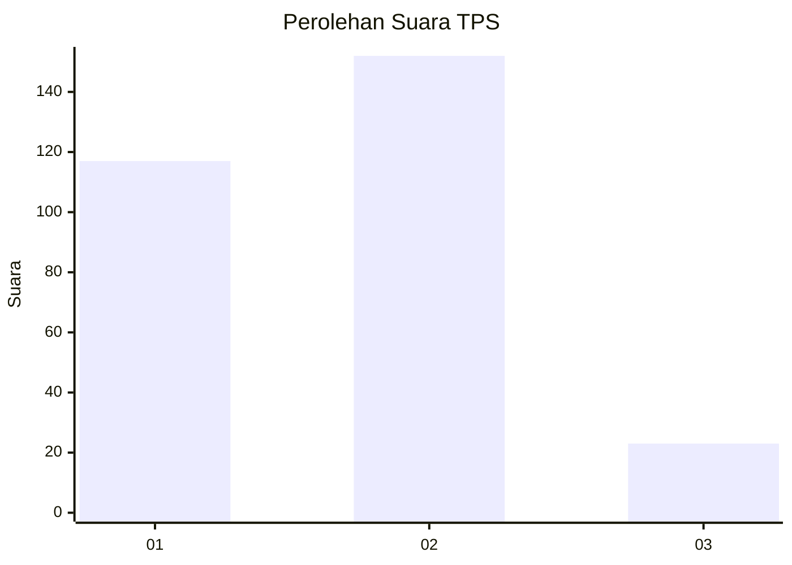
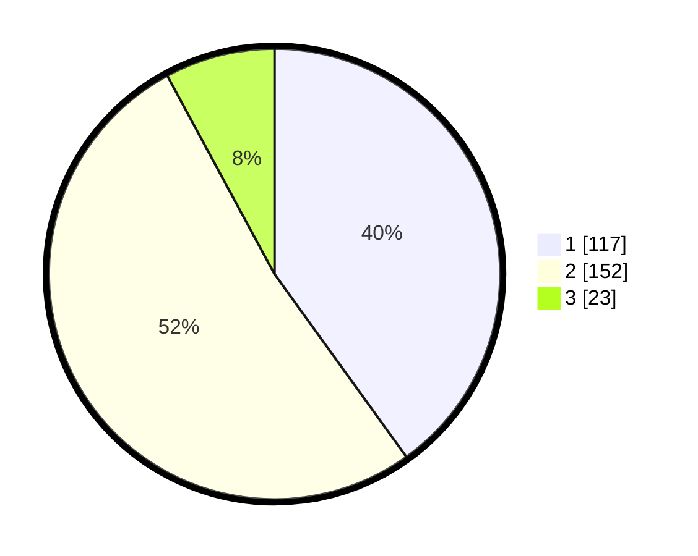

# Hasil

## Grafik

## Tabel

| No. | Nama Paslon    | Suara | Suara (raw) | Persentase |
|:--- |:-------------- | -----:| -----------:| ----------:|
| 1   | ANIES MUHAIMIN | 117   | [117][p-1]  | 40,07      |
| 2   | PRABOWO GIBRAN | 152   | [152][p-2]  | 52,05      |
| 3   | GANJAR MAHFUD  | 23    | [23][p-3]   | 7,88       |

[p-1]: https://github.com/gigit-pemilu/pemilu-2024-18-lampung/blob/main/pilpres/hitung-suara/sub/18-lampung/sub/71-kota-bandar-lampung/sub/18-kedamaian/sub/1005-kalibalau-kencana/sub/011-tps/sub/paslon-1.txt
[p-2]: https://github.com/gigit-pemilu/pemilu-2024-18-lampung/blob/main/pilpres/hitung-suara/sub/18-lampung/sub/71-kota-bandar-lampung/sub/18-kedamaian/sub/1005-kalibalau-kencana/sub/011-tps/sub/paslon-2.txt
[p-3]: https://github.com/gigit-pemilu/pemilu-2024-18-lampung/blob/main/pilpres/hitung-suara/sub/18-lampung/sub/71-kota-bandar-lampung/sub/18-kedamaian/sub/1005-kalibalau-kencana/sub/011-tps/sub/paslon-3.txt

## Foto C Plano

https://sirekap-obj-formc.kpu.go.id/149c/pemilu/ppwp/18/71/18/10/05/1871181005011-20240218-173621--7ff810f3-c10e-4082-859d-ae32000ecd78.jpg

https://sirekap-obj-formc.kpu.go.id/149c/pemilu/ppwp/18/71/18/10/05/1871181005011-20240214-230800--69073fd5-00a6-4ba2-a095-3b8de2511a9a.jpg

https://sirekap-obj-formc.kpu.go.id/149c/pemilu/ppwp/18/71/18/10/05/1871181005011-20240215-032938--65436d30-1f3b-444d-85f3-cdff8c27524c.jpg

## Metadata

| Key        | Value               |
| ---------- | ------------------- |
| Time Stamp | 2024-02-19 06:16:00 |

