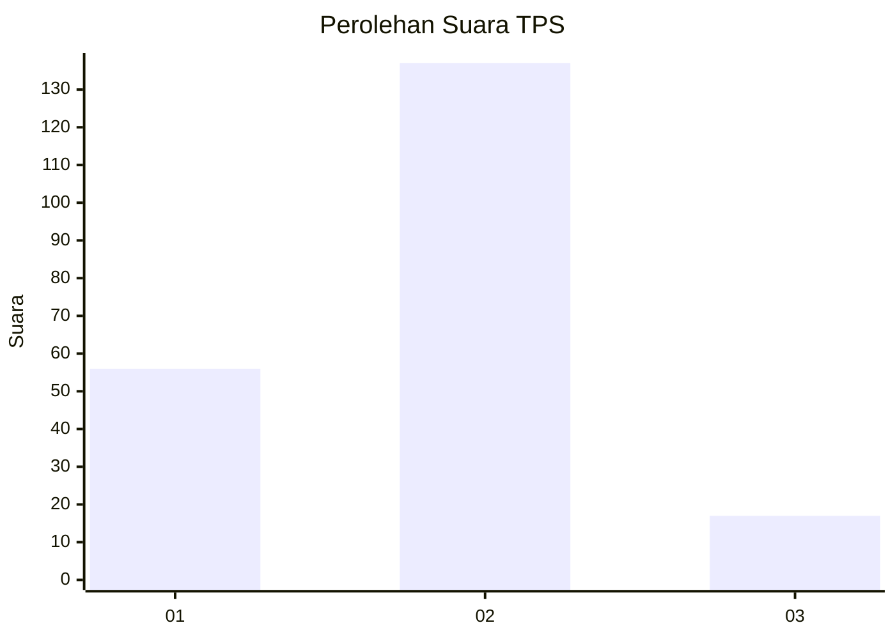
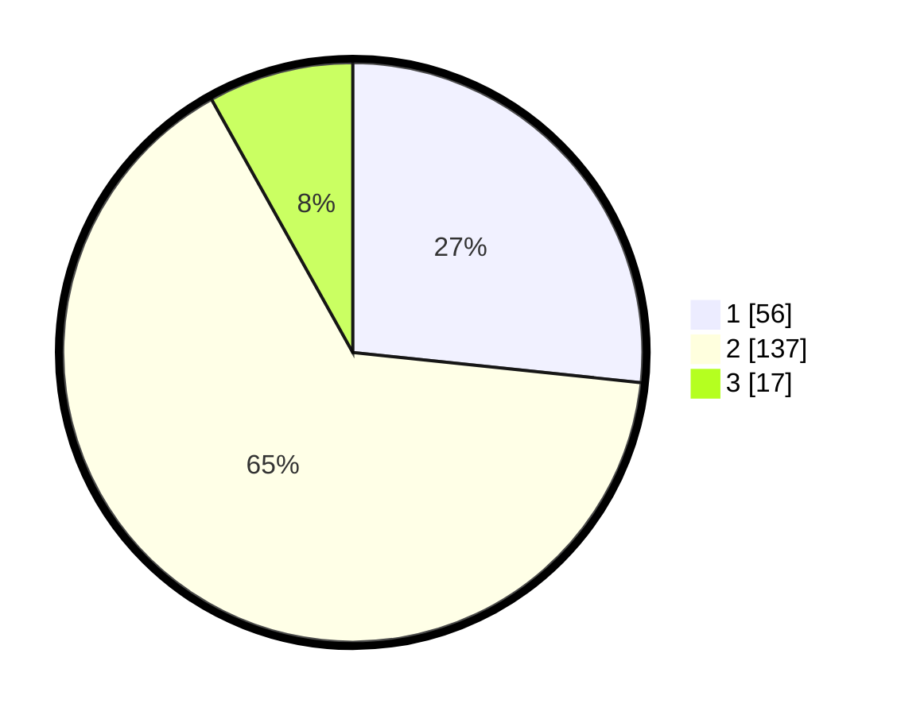

# Hasil

## Grafik

## Tabel

| No. | Nama Paslon    | Suara | Suara (raw) | Persentase |
|:--- |:-------------- | -----:| -----------:| ----------:|
| 1   | ANIES MUHAIMIN | 56    | [56][p-1]   | 26,67      |
| 2   | PRABOWO GIBRAN | 137   | [137][p-2]  | 65,24      |
| 3   | GANJAR MAHFUD  | 17    | [17][p-3]   | 8,10       |

[p-1]: https://github.com/gigit-pemilu/pemilu-2024-18-lampung/blob/main/pilpres/hitung-suara/sub/18-lampung/sub/71-kota-bandar-lampung/sub/19-telukbetung-timur/sub/1001-kota-karang/sub/004-tps/sub/paslon-1.txt
[p-2]: https://github.com/gigit-pemilu/pemilu-2024-18-lampung/blob/main/pilpres/hitung-suara/sub/18-lampung/sub/71-kota-bandar-lampung/sub/19-telukbetung-timur/sub/1001-kota-karang/sub/004-tps/sub/paslon-2.txt
[p-3]: https://github.com/gigit-pemilu/pemilu-2024-18-lampung/blob/main/pilpres/hitung-suara/sub/18-lampung/sub/71-kota-bandar-lampung/sub/19-telukbetung-timur/sub/1001-kota-karang/sub/004-tps/sub/paslon-3.txt

## Foto C Plano

https://sirekap-obj-formc.kpu.go.id/6dc3/pemilu/ppwp/18/71/19/10/01/1871191001004-20240219-104626--a8dad38a-9cac-4ca4-8555-6dce2fb68979.jpg

https://sirekap-obj-formc.kpu.go.id/6dc3/pemilu/ppwp/18/71/19/10/01/1871191001004-20240219-104700--b920fedb-9021-46c8-b142-1f5a845867ce.jpg

https://sirekap-obj-formc.kpu.go.id/6dc3/pemilu/ppwp/18/71/19/10/01/1871191001004-20240219-104737--d7c6343d-f035-4b9f-8ec1-81579a763655.jpg

## Metadata

| Key        | Value               |
| ---------- | ------------------- |
| Time Stamp | 2024-02-25 13:00:00 |

