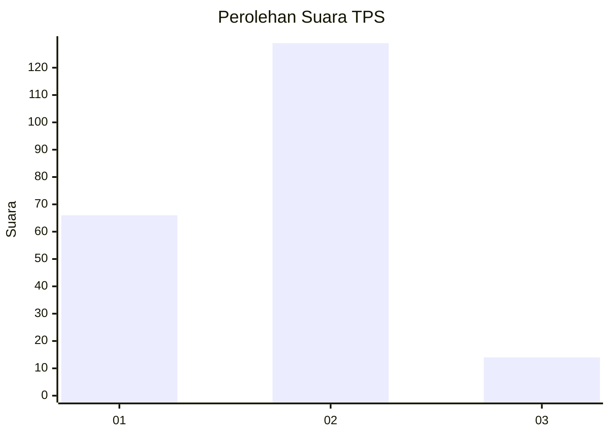
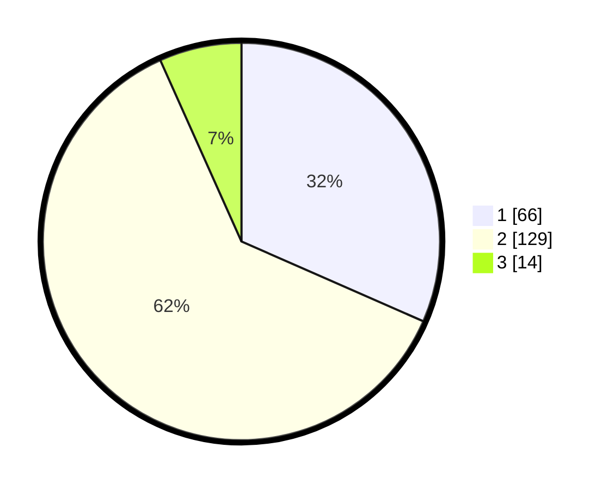

# Hasil

## Grafik

## Tabel

| No. | Nama Paslon    | Suara | Suara (raw) | Persentase |
|:--- |:-------------- | -----:| -----------:| ----------:|
| 1   | ANIES MUHAIMIN | 66    | [66][p-1]   | 31,58      |
| 2   | PRABOWO GIBRAN | 129   | [129][p-2]  | 61,72      |
| 3   | GANJAR MAHFUD  | 14    | [14][p-3]   | 6,70       |

[p-1]: https://github.com/gigit-pemilu/pemilu-2024-18-lampung/blob/main/pilpres/hitung-suara/sub/18-lampung/sub/71-kota-bandar-lampung/sub/19-telukbetung-timur/sub/1001-kota-karang/sub/005-tps/sub/paslon-1.txt
[p-2]: https://github.com/gigit-pemilu/pemilu-2024-18-lampung/blob/main/pilpres/hitung-suara/sub/18-lampung/sub/71-kota-bandar-lampung/sub/19-telukbetung-timur/sub/1001-kota-karang/sub/005-tps/sub/paslon-2.txt
[p-3]: https://github.com/gigit-pemilu/pemilu-2024-18-lampung/blob/main/pilpres/hitung-suara/sub/18-lampung/sub/71-kota-bandar-lampung/sub/19-telukbetung-timur/sub/1001-kota-karang/sub/005-tps/sub/paslon-3.txt

## Foto C Plano

https://sirekap-obj-formc.kpu.go.id/22c8/pemilu/ppwp/18/71/19/10/01/1871191001005-20240214-213303--01046dd0-dd99-4d50-8584-c96633348c94.jpg

https://sirekap-obj-formc.kpu.go.id/22c8/pemilu/ppwp/18/71/19/10/01/1871191001005-20240214-213704--6373e71a-347a-40b6-9ab3-eb218febfe81.jpg

https://sirekap-obj-formc.kpu.go.id/22c8/pemilu/ppwp/18/71/19/10/01/1871191001005-20240214-214145--8a7a5446-4359-4595-a6bf-7a8a05fae409.jpg

## Metadata

| Key        | Value               |
| ---------- | ------------------- |
| Time Stamp | 2024-02-17 10:30:03 |

