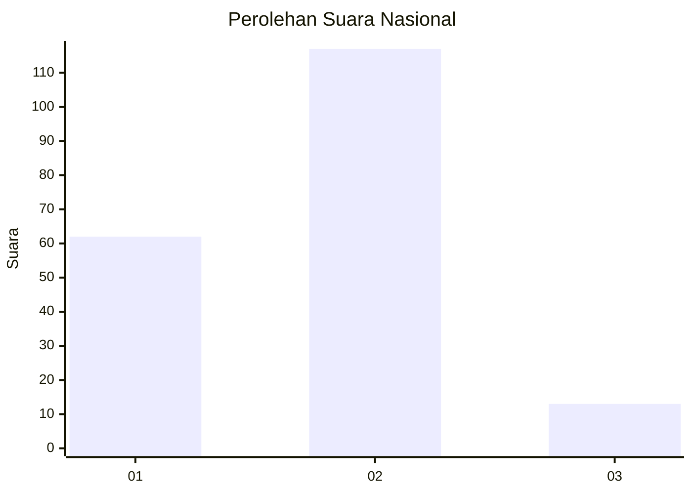
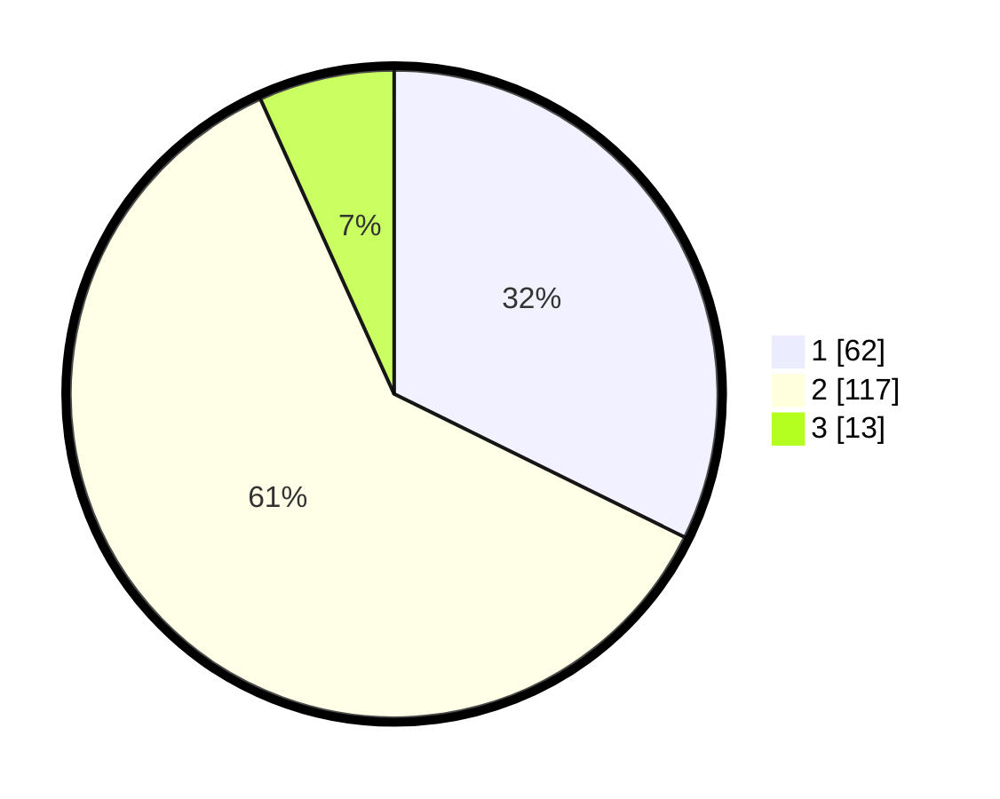

# Hasil

## Grafik

## Tabel

| No. | Nama Paslon    | Suara | Suara (raw) | Persentase |
|:--- |:-------------- | -----:| -----------:| ----------:|
| 1   | ANIES MUHAIMIN | 62    | [62][p-1]   | 32,29      |
| 2   | PRABOWO GIBRAN | 117   | [117][p-2]  | 60,94      |
| 3   | GANJAR MAHFUD  | 13    | [13][p-3]   | 6,77       |

[p-1]: https://github.com/gigit-pemilu/pemilu-2024/blob/main/pilpres/hitung-suara/sub/18-lampung/sub/71-kota-bandar-lampung/sub/19-telukbetung-timur/sub/1005-sukamaju/sub/005-tps/sub/paslon-1.txt
[p-2]: https://github.com/gigit-pemilu/pemilu-2024/blob/main/pilpres/hitung-suara/sub/18-lampung/sub/71-kota-bandar-lampung/sub/19-telukbetung-timur/sub/1005-sukamaju/sub/005-tps/sub/paslon-2.txt
[p-3]: https://github.com/gigit-pemilu/pemilu-2024/blob/main/pilpres/hitung-suara/sub/18-lampung/sub/71-kota-bandar-lampung/sub/19-telukbetung-timur/sub/1005-sukamaju/sub/005-tps/sub/paslon-3.txt

## Foto C Plano

https://sirekap-obj-formc.kpu.go.id/21ca/pemilu/ppwp/18/71/19/10/05/1871191005005-20240219-105701--e0111529-1fab-4e3b-9a35-d4f7e8dde2d2.jpg

https://sirekap-obj-formc.kpu.go.id/21ca/pemilu/ppwp/18/71/19/10/05/1871191005005-20240219-105846--516d0f9a-39ed-4367-b33e-0c8862a38ac7.jpg

https://sirekap-obj-formc.kpu.go.id/21ca/pemilu/ppwp/18/71/19/10/05/1871191005005-20240219-105926--16dc5de9-8633-4cfd-8a43-7789607ea626.jpg

## Metadata

| Key        | Value               |
| ---------- | ------------------- |
| Time Stamp | 2024-02-24 22:31:28 |

## DATA PEMILIH TETAP

Jumlah pemilih dalam DPT: **280**.
 * L: **40**.
 * P: **428**.

## DATA PENGGUNA HAK PILIH

Jumlah pengguna hak pilih dalam DPT: **485**.
 * L: **895**.
 * P: **490**.

Jumlah pengguna hak pilih dalam DPTb: **889**.
 * L: **882**.
 * P: **887**.

Jumlah pengguna hak pilih dalam DPK: **888**.
 * L: **888**.
 * P: **808**.

Jumlah pengguna hak pilih: **494**.
 * L: **897**.
 * P: **897**.

## JUMLAH SUARA SAH DAN TIDAK SAH

JUMLAH SELURUH SUARA SAH: **192**.

JUMLAH SUARA TIDAK SAH: **2**.

JUMLAH SELURUH SUARA SAH DAN SUARA TIDAK SAH: **194**.

